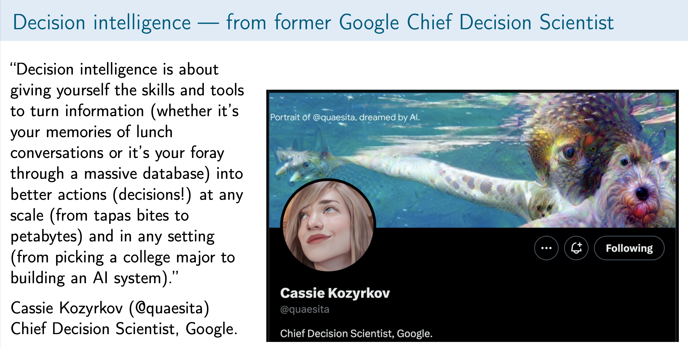
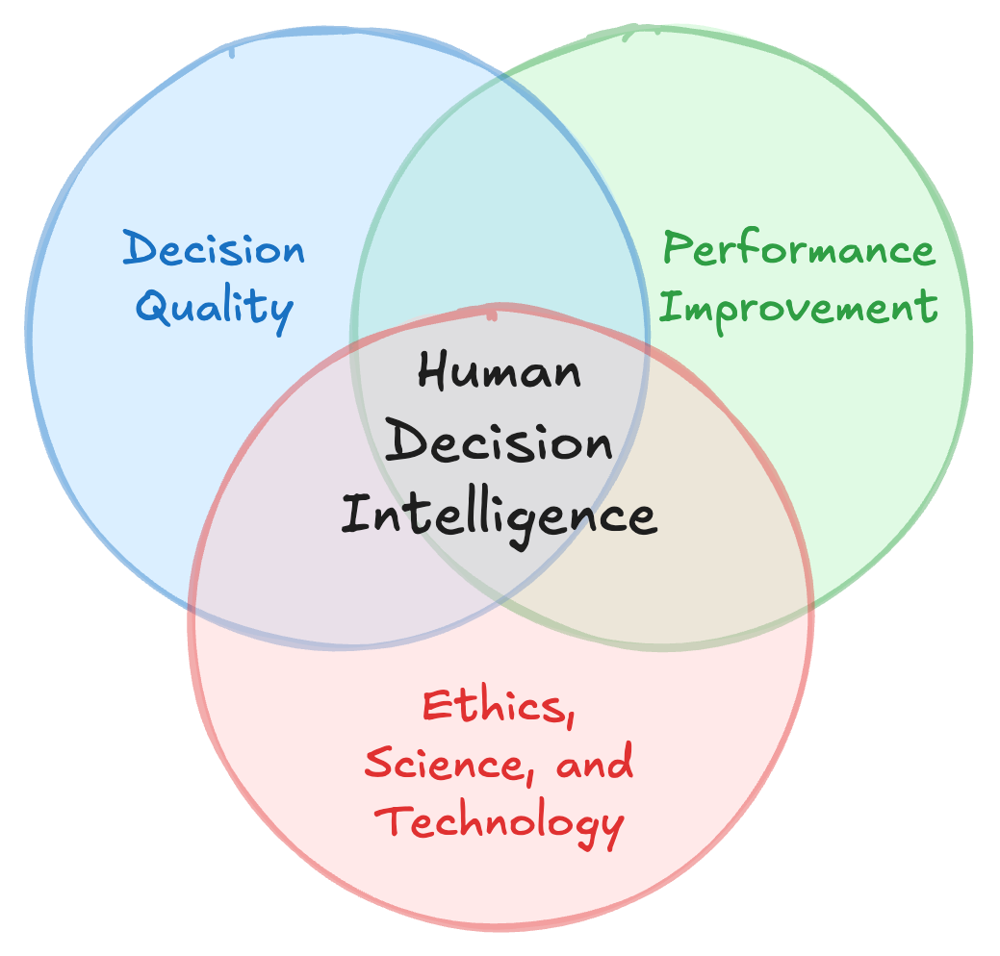

# CDPH is building a Decision Intelligence Unit

Tomás Aragón, MD, DrPH 
Former State Public Health Officer and Director  
California Department of Public Health  
[tomas.aragon@berkeley.edu](mailto:tomas.aragon@berkeley.edu) (email)  
https://teampublichealth.substack.com/ (blog)

## Decision-making is our most important activity

“A decision is a choice between two or more
alternatives that involves an irrevocable allocation
of resources.” “...your decision-making is the
single most important thing you have control over
that will help you achieve your goals.” Every
decision has causal assumptions, predictions, and
opportunity costs—the lost benefits of the better
option(s) not chosen or not considered.

In service of our values and goals, [human Decision Intelligence](https://teampublichealth.substack.com/t/human-decision-intelligence) (Figure 1) is using ethics,
science, and technology to improve team decision-making in the face of uncertainty,
trade-offs, and time constraints. HDI prioritizes
improving human decision-making capabilities.

  

The CDPH Office of Policy and Planning will have a Decision Intelligence Unit (DIU) to develop, implement, and improve strategic decision-making methods for high stakes, high cost, and high impact public health decisions. Methods will include cost-benefit and cost-effective analyses, and decision analysis. These positions have permanent funding. We will secure grants and develop collaborative partnerships with academic institutions. The major areas of initial focus, development, and collaboration will be

-	Decision making under uncertainty, including [deep uncertainty](https://www.rand.org/pubs/external_publications/EP67833.html) (ie, risks not calculable)
-	Methods to optimize policy and regulatory decisions; conduct cost-effectiveness and cost-benefit analyses; and program budgeting and marginal analysis (PBMA)
-	[Computational algorithms for decision making](https://algorithmsbook.com/) (using Bayesian networks (including decision networks [influence diagrams]), Markov Decision Processes (MDPs), Partially Observable Markov Decision Processes (POMDPs), Reinforcement Learning, Agent-based modeling)
-	[Leaders/managers as decision architects](https://hbr.org/2015/05/leaders-as-decision-architects):[^da] Design and improve of team decision meetings that incorporate cognitive psychology and behavioral economics

[^da]: John Beshears and Francesca Gino (2015). Leaders as Decision Architects: Structure your organization’s work to encourage wise choices. Harvard Business Review. Available from:  [https://hbr.org/2015/05/leaders-as-decision-architects](https://hbr.org/2015/05/leaders-as-decision-architects)

The DIU will have a trans-disciplinary team:

-	Health economist with expertise in population health cost-benefit and cost-effectiveness analyses
-	Behavioral economist with expertise in decision implementation science
-	Computational decision scientist with expertise in programming (Julia, Python, R)
-	Population health data scientist
-	Biostatistician

The DIU is part of CDPH's longer term strategy to build our capability in population health data science (Table) and to move us to Levels 4 and 5.

|Level | Analysis | Description|
| :---: | --- | --- |
|1 | Description | a. surveillance and early detection of events|
| | | b. prevalence and incidence of risks and outcomes|
|2 | Prediction | a. early prediction and targeting of interventions|
|3| Explanation[^a] | a. discovery and testing of new causal pathways|
| | | b. estimation of intervention efficacy/effectiveness|
|4| Simulation | a. modeling for epidemiologic or decision insights|
|5| Optimization[^b] | a. optimizing decision, effectiveness, or efficiency metrics|

[^a]: Causal inference. See Judea Pearl. The Book of Why: The new science of cause and effect. Penguin 2019

[^b]: Decision analysis, cost-effectiveness/benefit analysis, mathematical modeling, operations research, etc.

Here is a graphical depiction of the Table.[^bayesialab] We aim to embrace our "reasoning" to make better decisions.

[^bayesialab]: Source: https://www.bayesia.com/articles/#!bayesialab-knowledge-hub/1-introduction 

To learn more about books relevant to decision intelligence, [here is my list](https://drtomasaragon.github.io/posts/2022-08-20-decision-intelligence-books/).

## Appendix

Here is an alternative, but very informative, view of decision intelligence (see two figures below):[^wequity]

[^wequity]: Source: https://wequity.tech/decision-intelligence-and-design-thinking/

 

